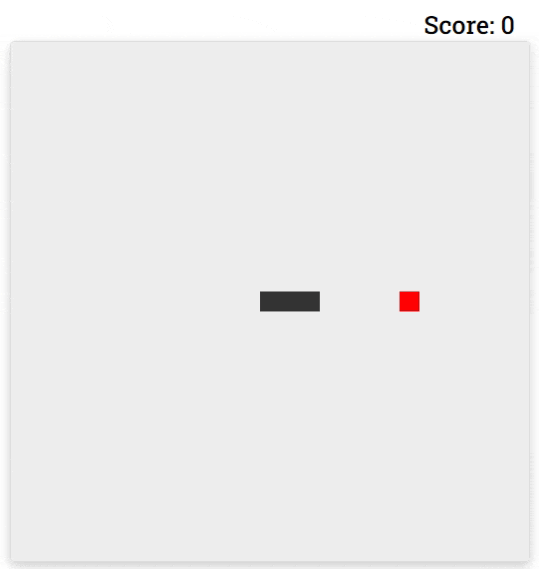

# Vanilla Javascript Snake

## Overview

A simple, brower snake game made with Javascript.
[Try a demo](https://js-snake-nk.netlify.app)

## Todo
- Make object orientated
- Optimize
- Add themes
- Start screen

## Aknowledgements
Created by Nasser Kessas

## Contributing
PRs accepted, feel free to dive in! [Open an issue](https://github.com/nasserkessas/js-snake/issues/new) or submit PRs.

Js snake follows the [Contributor Covenant](http://contributor-covenant.org/version/1/3/0/) Code of Conduct.
